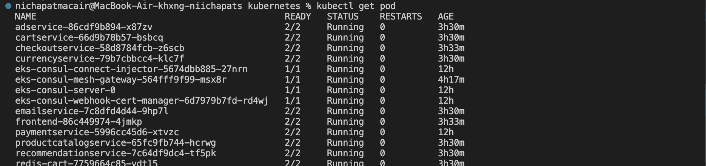
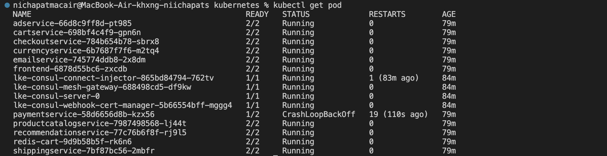
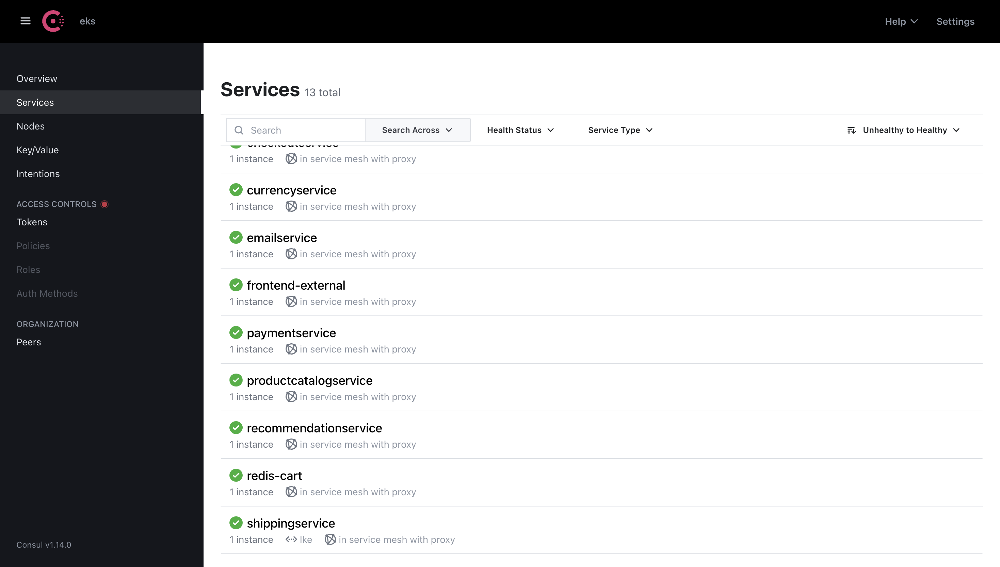
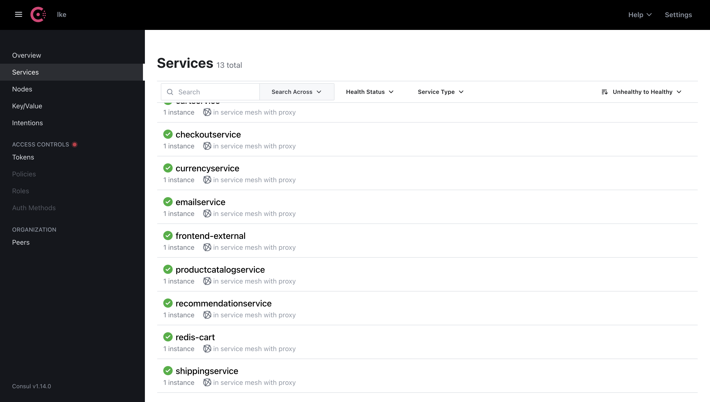
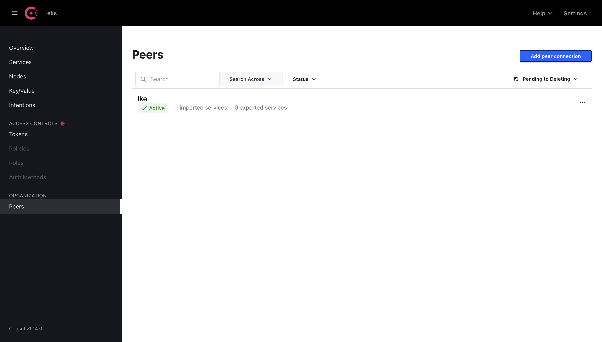
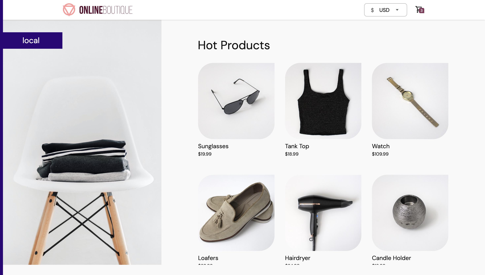
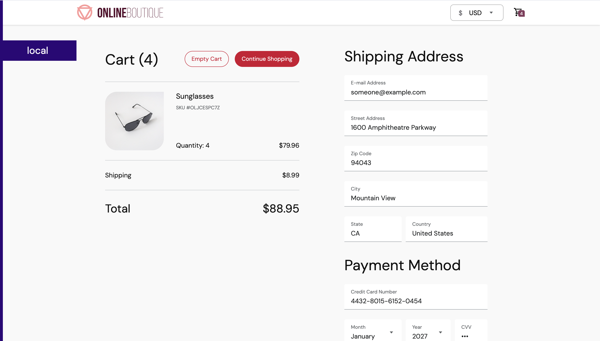

# Multi-Cloud Kubernetes Deployment with Consul Service Mesh for E-Commerce Microservices

## Overview

This project demonstrates a multi-cluster / multi-cloud e-commerce application deployed using Kubernetes and HashiCorp Consul as a service mesh. The Online Boutique microservices application is deployed across two cloud environments — **AWS EKS** and **Linode LKE** — with cross-cluster communication, mTLS encryption, and automatic failover powered by Consul.

This repository accompanies the [Consul Service Mesh Crash Course](https://www.youtube.com/watch?v=s3I1kKKfjtQ) by TechWorld with Nana.

---

## Acknowledgements

This project is based on the following original sources. All credit for the foundational architecture, teaching material, and implementation concepts belongs to the original authors.

- **TechWorld with Nana** — Consul crash course, Helm values, manifest files, and multi-cluster setup:
  - YouTube: [https://www.youtube.com/watch?v=s3I1kKKfjtQ](https://www.youtube.com/watch?v=s3I1kKKfjtQ)
  - GitLab: [https://gitlab.com/twn-youtube/consul-crash-course](https://gitlab.com/twn-youtube/consul-crash-course)
- **Google Cloud Platform** — Online Boutique microservices demo application:
  - GitHub: [https://github.com/GoogleCloudPlatform/microservices-demo](https://github.com/GoogleCloudPlatform/microservices-demo)
  - Licensed under Apache License 2.0

> Note: This repository uses publicly available GCP container images rather than rebuilding from source.

---

## Architecture Overview

```
[Cluster 1 - AWS EKS (ap-southeast-1)]     [Cluster 2 - Linode LKE (ap-south)]
  ├── Online Boutique (all services)          ├── Online Boutique (all services)
  ├── Consul Server                           ├── Consul Server
  ├── Consul Connect Injector                 ├── Consul Connect Injector
  └── Consul Mesh Gateway <─────────────────> └── Consul Mesh Gateway
               │                                          │
               └──────────── Consul Peering ──────────────┘
```

The system consists of:
- **Terraform** → provisions AWS infrastructure (VPC, EKS cluster, node groups)
- **Kubernetes** → deploys all microservices and Consul components
- **Consul** → enables service mesh, mTLS, cross-cluster peering, and failover

### Cross-Cluster Communication
- **Exported Service** → service shared from one cluster to peer
- **Imported Service** → service consumed from peer cluster
- Traffic is routed via Consul mesh gateways with automatic failover via `service-resolver.yaml`

---

## Prerequisites

| Tool | Purpose |
|------|---------|
| `kubectl` | Kubernetes CLI |
| `helm` | Kubernetes package manager |
| `terraform` | Infrastructure as Code |
| `aws cli` | AWS account management |
| `eksctl` | EKS cluster management |

---

## Setup and Deployment

### 1. Provision AWS Infrastructure with Terraform

```bash
cd terraform

# Initialize project and download providers
terraform init

# Preview execution plan
terraform plan -var-file terraform.tfvars

# Apply infrastructure
terraform apply -var-file terraform.tfvars -auto-approve

# View tracked resources
terraform state list
```

To destroy all resources:
```bash
terraform destroy -var-file terraform.tfvars
```

---

### 2. Configure AWS CLI

```bash
aws configure
# Enter: Access Key ID, Secret Access Key, Region (ap-southeast-1), Output format (json)
```

Validate cluster:
```bash
aws eks list-clusters --region ap-southeast-1 --output table --query 'clusters'

aws eks describe-cluster --region ap-southeast-1 --name myapp-eks-cluster --query 'cluster.resourcesVpcConfig'
```

---

### 3. Connect kubectl to EKS

```bash
aws eks update-kubeconfig --region ap-southeast-1 --name myapp-eks-cluster

# Verify connectivity
kubectl get nodes
kubectl get svc
```

---

### 4. Deploy Online Boutique on EKS

```bash
# Deploy app (standard)
kubectl apply -f kubernetes/config.yaml

# Or deploy with Consul sidecar injection enabled
kubectl apply -f kubernetes/config-consul.yaml
```

Get frontend URL:
```bash
kubectl get svc frontend-external
```

---

### 5. Install Consul on EKS (Cluster 1)

```bash
helm repo add hashicorp https://helm.releases.hashicorp.com
helm repo update

helm install eks hashicorp/consul \
  --version 1.0.0 \
  --values kubernetes/consul-values.yaml \
  --set global.datacenter=eks \
  --set server.storageClass=gp2
```

Apply mesh gateway:
```bash
kubectl apply -f kubernetes/consul-mesh-gateway.yaml
```

Verify:
```bash
kubectl get pods
kubectl get svc | grep consul
```

---

### 6. Create LKE Cluster (Cluster 2 — Linode)

1. Log in to [cloud.linode.com](https://cloud.linode.com)
2. Go to **Kubernetes → Create Cluster**
3. Configure:
   - Label: `lke-consul`
   - Region: `SG, Singapore (ap-south)`
   - Kubernetes Version: `1.32`
4. Download the kubeconfig file

Configure access:
```bash
chmod 700 ~/Downloads/lke-consul-kubeconfig.yaml
export KUBECONFIG=~/Downloads/lke-consul-kubeconfig.yaml
kubectl get nodes
```

---

### 7. Install Consul on LKE (Cluster 2)

```bash
helm install lke hashicorp/consul \
  --version 1.0.0 \
  --values kubernetes/consul-values.yaml \
  --set global.datacenter=lke
```

---

### 8. Connect the Two Clusters (Consul Peering)

**On EKS Consul UI:**
1. Go to **Peers → Add peer connection**
2. Generate a peering token named `lke`
3. Copy the token

**On LKE Consul UI:**
1. Go to **Peers → Add peer connection**
2. Paste the token from EKS
3. Confirm status shows **Active**

---

### 9. Apply Cross-Cluster Policies

Run on each cluster as needed:
```bash
kubectl apply -f kubernetes/exported-service.yaml
kubectl apply -f kubernetes/intentions.yaml
kubectl apply -f kubernetes/service-resolver.yaml
```

Optional diagnostics:
```bash
kubectl apply -f kubernetes/debug-pod.yaml
```

---

### 10. Verify Multi-Cloud Setup

Switch between clusters:
```bash
# Check current context
kubectl config current-context

# Switch to EKS
export KUBECONFIG=~/.kube/config

# Switch to LKE
export KUBECONFIG=~/Downloads/lke-consul-kubeconfig.yaml
```

Verify pods on both clusters:
```bash
kubectl get pod
```

---

## Screenshots and Evidence

### Cluster Setup

All pods running on EKS cluster (2/2 with Consul sidecar injection).


All pods running on LKE cluster.

### Consul Service Mesh

Consul UI on EKS — 13 services registered, all healthy.


Consul UI on LKE — 13 services registered, all healthy.

### Cross-Cluster Peering

EKS Consul UI showing LKE peer connection is Active.


LKE Consul UI showing EKS peer connection is Active.

### Application


Online Boutique e-commerce app accessible via AWS EKS LoadBalancer.

---

## References

- Consul Helm Chart Reference: [https://developer.hashicorp.com/consul/docs/reference/k8s/helm](https://developer.hashicorp.com/consul/docs/reference/k8s/helm)
- Required Ports for Consul: [https://developer.hashicorp.com/consul/docs/reference/architecture/ports](https://developer.hashicorp.com/consul/docs/reference/architecture/ports)
- TechWorld with Nana GitLab: [https://gitlab.com/twn-youtube/consul-crash-course](https://gitlab.com/twn-youtube/consul-crash-course)
- GCP Microservices Demo: [https://github.com/GoogleCloudPlatform/microservices-demo](https://github.com/GoogleCloudPlatform/microservices-demo)